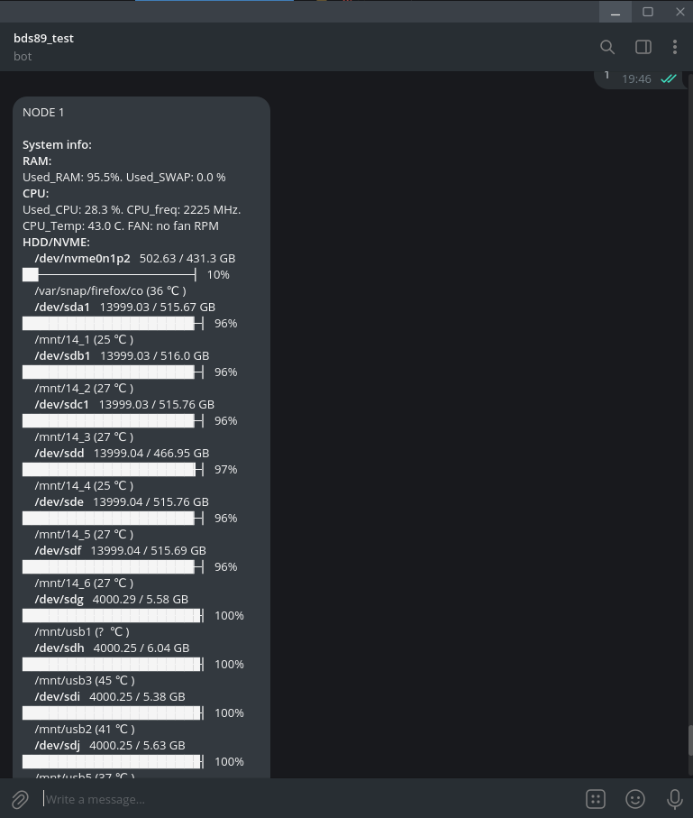
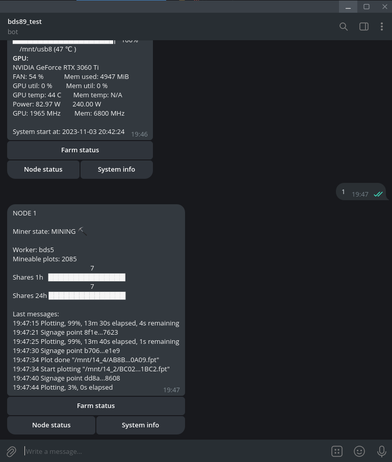

# Chia NoSSD bot

Control and monitoring for NoSSD Chia pool client.





## Описание
....

**Поддерживаемые ОС**

- Linux

**Установка**

  ```bash
  pip install git+https://github.com/bds89/ChiaNoSSD
  ```
Если требуется создание ярлыков после установки, выполните:
  ```bash
  chia-nossd_shortcut
  ```

Запуск возможен либо с ярлыка, либо командой:
  ```bash
  chia-nossd
  ```
